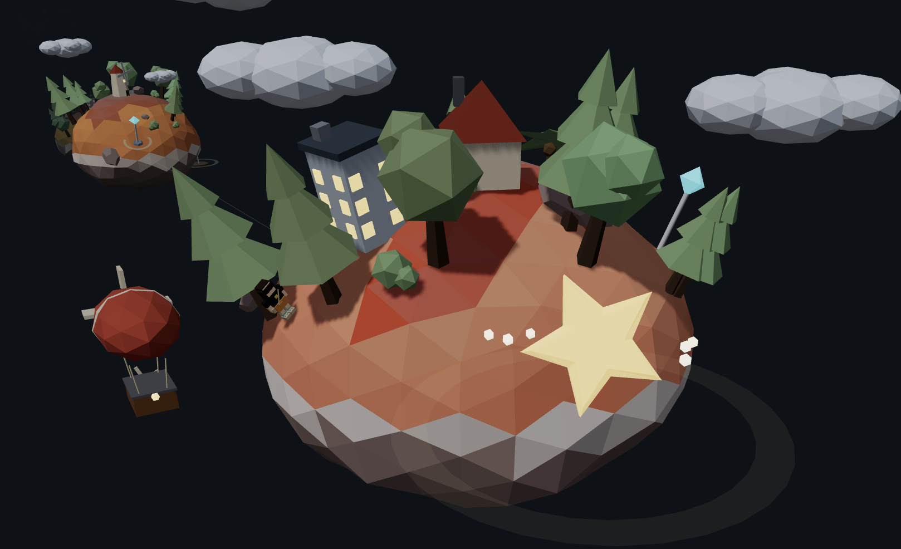

# Career Journey

一份做成 3D 互動旅程的前端工程師履歷。捲動頁面時，相機會沿著一條路徑飛過五座島嶼，每一座代表職涯的一個階段；停靠時可以拖曳環繞島嶼，點擊島上的告示牌查看專案細節。



> 畫面中：飛船載著旅人停靠在最後一站，島上有辦公樓、小屋與告示牌，右側的金色星星是藏起來的 side project。遠處是上一站的島嶼。


場景全部是程式生成的，沒有使用任何外部 3D 模型檔案。clone 下來跑 `npm run dev` 就能實際捲動體驗。

## 特色

**捲動即航行** — 五個停靠站用 Catmull-Rom 曲線串成平滑路徑，捲動進度映射成相機在曲線上的位置。相機不直接走在曲線上（那樣會穿過島的中心），而是往側邊與上方偏移，並看向前方一點，保留航行感的同時確保每座島都在畫面裡。

**停靠與環繞** — 每段路程的前後各有一段「停靠區」，相機在這裡停住並緩慢環繞島嶼，也可以按住拖曳自由轉動視角。離站時角度會歸零，抵達下一站才不會突然大轉。

**程式生成的島嶼** — 地形用多層 Perlin noise 疊加，依高度區分海岸沙灘、草地與山頂岩石；樹木、岩石、灌木與建築都是程式擺放的低多邊形造型，用 seed 固定亂數讓結果每次都一樣。

**飛船與旅人** — 一艘飛船載著人物沿路徑飛行，捲到停靠站時人物會跳下船、繞島散步一圈，離站前回到碼頭跳上船。

**可點擊的專案標記** — 島上的告示牌、路徑上的浮標、以及飄在最後一座島旁邊的隱藏彩蛋。滑過顯示專案名稱，點擊彈出做成登機證票根樣式的詳情卡片，站號會依掛載方式變成 `STOP 03`、`TRANSIT 03/04` 或 `EXTRA FLIGHT`。

**抵達卡** — 捲到旅程終點時，站點文字會交棒給一張抵達卡：正面是自我介紹與未來方向，背面是分級的技能清單。

## 技術棧

| | |
| --- | --- |
| 框架 | React 19 + Vite 8 |
| 3D | Three.js + @react-three/fiber |
| 捲動控制 | GSAP ScrollTrigger |
| Lint | Oxlint |

介面樣式全部用 inline style 撰寫，沒有引入 CSS 框架——這個專案的視覺幾乎都在 3D 場景裡，2D 的部分只有少數幾個疊加層，引入框架的效益不大。

## 開始使用

```bash
npm install
npm run dev      # 開發伺服器
npm run build    # 產生 production build
npm run preview  # 預覽 build 結果
npm run lint     # Oxlint 檢查
```

## 專案結構

```
src/
├── CareerJourney.jsx      # 主要進場：STOPS 資料、捲動綁定、相機環繞、整體場景組裝
├── journeyMath.js         # 捲動進度 ↔ 路程段落／停靠比例的共用數學
├── projects.js            # 專案作品資料與掛載方式
├── Contact.jsx            # 常駐聯絡入口、旅程終點的抵達卡（含技能清單）
├── island/
│   ├── Island.jsx         # 一座島 = 地形 + 裝飾物 + 專案告示牌
│   ├── terrain.js         # noise 地形生成、配色、島嶼旋轉
│   └── Props.jsx          # 樹木／岩石／灌木／建築／雲的低多邊形造型
├── markers/
│   ├── ProjectPin.jsx      # 告示牌／浮標／彩蛋星星的 3D 造型與互動
│   ├── FloatingMarkers.jsx # 不掛在島上的標記（路上浮標、彩蛋）定位邏輯
│   └── ProjectCard.jsx     # 點擊後的專案詳情卡片 UI
└── traveler/
    ├── Traveler.jsx        # 飛船＋人物沿路徑移動、停靠時下船散步
    ├── Airship.jsx         # 飛船造型
    └── Character.jsx       # 人物造型與走路動畫
```

## 修改內容

大部分的內容調整都不需要動到 3D 的部分：

| 想改什麼 | 改哪裡 |
| --- | --- |
| 職涯階段（標題、時間、描述、島嶼外觀） | `src/CareerJourney.jsx` 的 `STOPS` |
| 專案作品的內容與掛載位置 | `src/projects.js` |
| 聯絡方式、自我介紹、技能清單 | `src/Contact.jsx` |

新增一座島只要在 `STOPS` 加一筆：路徑長度、捲動高度、相機停靠點都是從陣列長度算出來的，不需要改其他地方。

專案標記的 `attach` 決定它出現在哪裡：

```js
{ islandIndex: 2, dir: [-0.45, 0.45, 0.77] }   // 貼在第 3 座島的表面
{ kind: 'path', afterIndex: 2 }                 // 浮在第 3、4 座島之間的路上
{ kind: 'orbit', islandIndex: 4, offset: [...] } // 飄在第 5 座島旁邊
```
